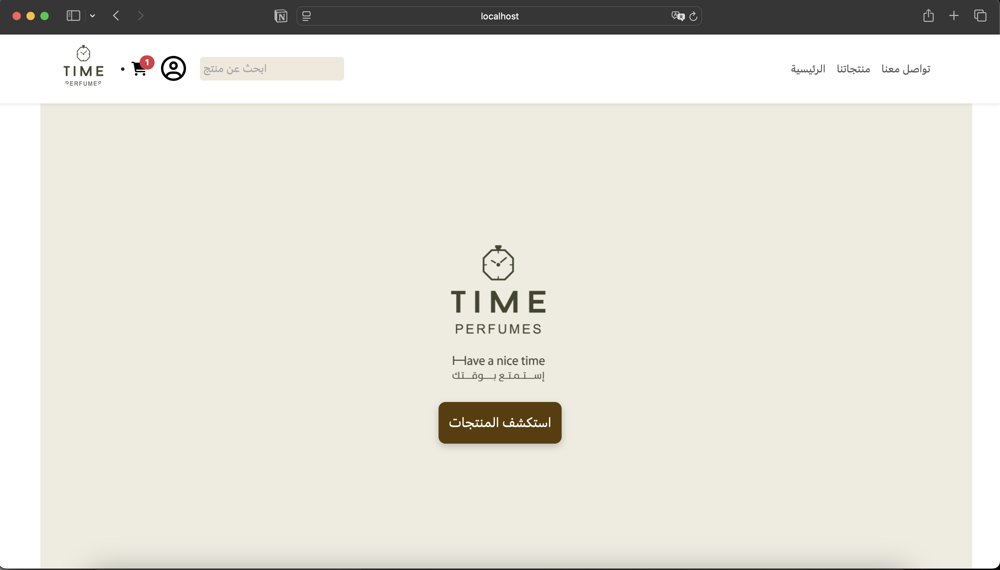

# 🕰️ Time Perfumes Website
## 📌 Project Overview
Time Perfumes is a web-based project designed to showcase and sell perfumes through a clean and elegant interface. The project focuses on delivering a smooth user experience along with an organized and functional admin system on the back-end.

## 🎯 Project Goals
* Display perfume products in an attractive and organized way.
* Enhance user experience during browsing.
* Provide an easy-to-use system for managing products and content.
* Combine visual design with functional performance.

## 💻 Project Scope
* Front-end design and development.
* Back-end design and development.
* Integration between front-end and back-end for full functionality.

## 🛠️ Technologies Used
* HTML.
* CSS.
* Bootstrap.
* JavaScript.
* PHP.
* MySQL.

## 🖼️ Key Features
* Modern and responsive design.
* User-friendly interface.
* Organized product management system.
* Scalable structure for future improvements.

## 🎥 Project Demo
Click below to view the demo video:

## 📬 Contact
If you would like to get in touch, feel free to contact me at:

📧 **Email:** arwaahalzain@email.com

